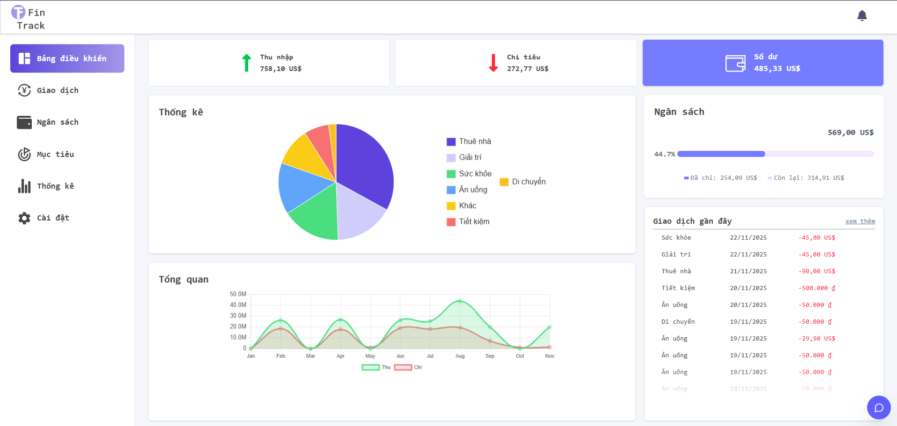

# 💰 FinTrack - Intelligent Personal Finance Management

> **Graduation Thesis Project** | **Full-stack Application**

[](https://fintrack-frontend-pg3r.onrender.com)

## 📖 Overview
**FinTrack** is a comprehensive financial management platform designed to help users track expenses, plan budgets, and receive personalized financial advice through an AI-powered Chatbot.

This repository contains the **Frontend** source code. For other components, please visit:
* 👉 **Backend API:** https://github.com/datle04/fintrack
* 👉 **AI Service:** https://github.com/datle04/chatbot-service

## ✨ Key Features
* **📊 Interactive Dashboard:** Real-time visualization of income and expenses using dynamic charts.
* **🤖 AI Financial Advisor:** Integrated with **Google Gemini**, providing context-aware financial advice and spending analysis.
* **📅 Transaction Management:** Support for recurring transactions, category filtering, and advanced search.
* **⚠️ Smart Alerts:** Notifications for overspending or upcoming bill payments.
* **qh Export Reports:** Generate detailed financial reports in PDF format.

## 🛠 Tech Stack
* **Core:** ReactJS (Vite).
* **State Management:** Redux Toolkit.
* **Styling:** TailwindCSS.
* **Data Visualization:** Recharts / Chart.js.
* **API Client:** Axios / RTK Query.

## Screenshots
| Dashboard View | AI Chatbot Interface |
|:---:|:---:|
|  |  |

## 🚀 Getting Started

### Prerequisites
* Node.js >= 18.x
* npm or yarn

### Installation
1.  **Clone the repository:**
    ```bash
    git clone [https://github.com/your-username/fintrack-frontend.git](https://github.com/your-username/fintrack-frontend.git)
    cd fintrack-frontend
    ```
2.  **Install dependencies:**
    ```bash
    npm install
    ```
3.  **Environment Setup:**
    Create a `.env` file in the root directory:
    ```env
    VITE_BACK_END_URL=http://localhost:5000
    VITE_CHATBOT_API_URL=http://localhost:4001
    ```
4.  **Run the application:**
    ```bash
    npm run dev
    ```

## 🤝 Contributing
This is a personal graduation project, but suggestions are welcome!
